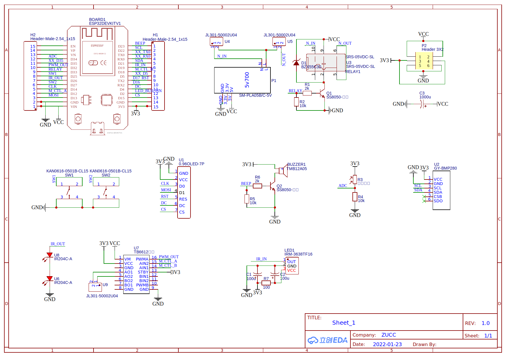
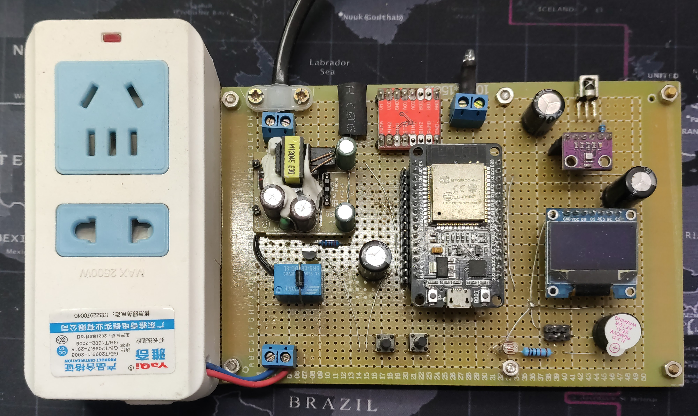
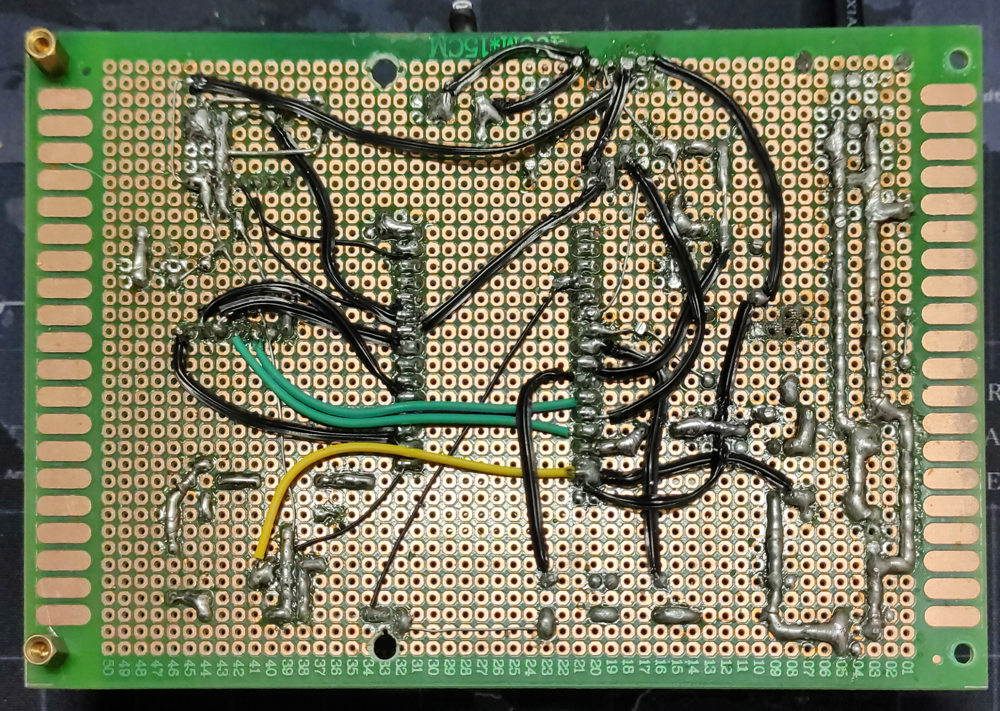

# IoT_Socket

This is `IoT Socket`, my
graduation project.  
This project is based on ESP32 MCU and Arduino platform.  
For `IoT Socket Android App`, see [**this repo**](https://github.com/gjs990825/IoT_Socket_App).

# Hardware Platform

## Schematic

  

 

## Perfboard prototype

Front side

  

 

Back side

  

 

# Links
These two Arduino libraries used in `IoT Socket` project are modified to adapt specific needs. Click links below to see original repos.

[Martin-Laclaustra/CronAlarms](https://github.com/Martin-Laclaustra/CronAlarms)  
[MaJerle/lwshell](https://github.com/MaJerle/lwshell)